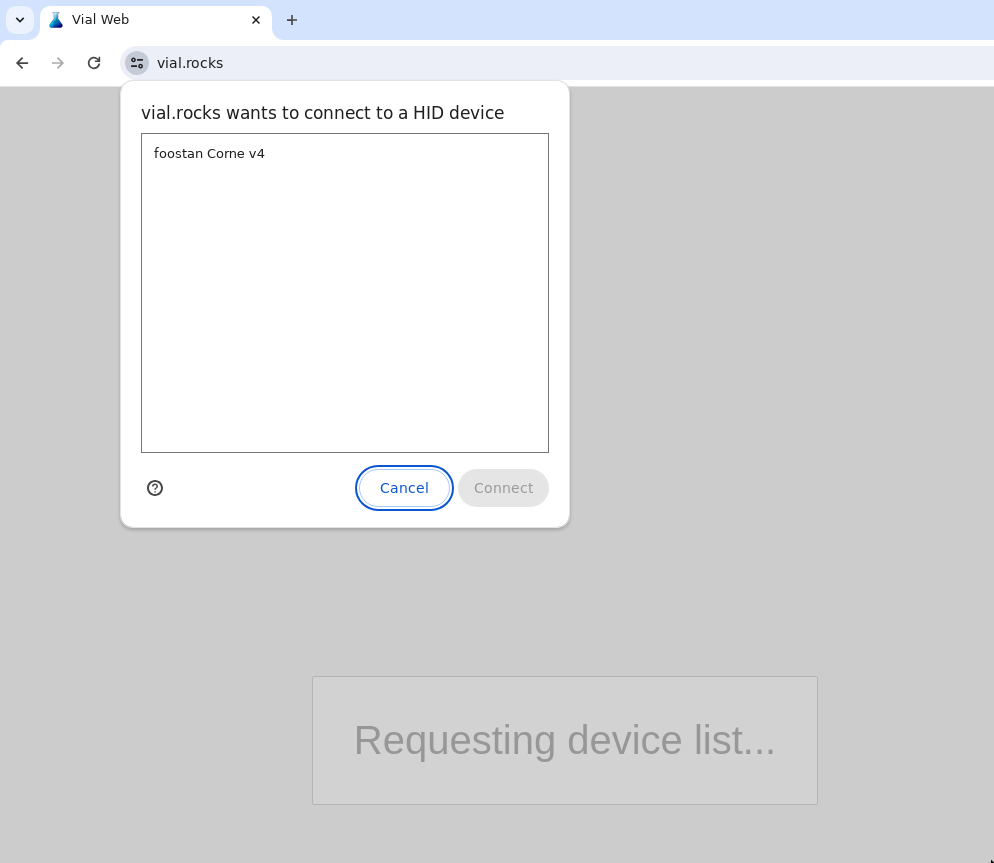

# v4

## Parts

| Part                 | Count   | Remark                    |
| -------------------- | ------- | ------------------------- |
| PCB                  | 1 set   |                           |
| Case bottom          | 1 set   |                           |
| Switch plate         | 1 set   |                           |
| Key switches         | 42 - 46 | Only Kailh choc v2 and v2 |
| Keycaps              | 42 - 46 | 1u 40 pcs, 1.5 2 pcs      |
| Spacer M2            | 8       | 7mm                       |
| Screw M2             | 16      | 5mm                       |
| Rubber cushion       | 8       |                           |
| TRRS (4 poles) cable | 1       |                           |
| Type-C cable         | 1       |                           |
| Rotary encoder       | 0 - 4   | Optional                  |

## Build

1. Cut free the two sides of the board.

<figure><figcaption>
<strong>Figure:</strong> PCB plate.
</figcaption></figure>

2. Add switches to the corners of the switch plate.

<figure><figcaption>
<strong>Figure:</strong> Switches in the corners of the switch plate.
</figcaption></figure>

3. Attach the PCB to the switch plate ensure that the switch prongs line up and do not bend. Once done, finish adding the rest of the switches in via the switch plate. Do not add keycaps on until a later stage as they make screwing the bottom plate in difficult.

<figure><figcaption>
<strong>Figure:</strong> PCB and switch plate attached via switches.
</figcaption></figure>

4. Screw in the spacers to the bottom plate. Ensure not to tighter too much as this can damage the PCB and/or spacers.

<figure><figcaption>
<strong>Figure:</strong> Spacers attached to the bottom plate via screws.
</figcaption></figure>

5. Place the PCB and switch plate on top of the spacers and screw them in. Ensure not to tighter too much as this can damage the PCB and/or spacers.

<figure><figcaption>
<strong>Figure:</strong> PCB and switch plate being attached to the spacers.
</figcaption></figure>

6. Add keycaps to the keyboard.

<figure><figcaption>
<strong>Figure:</strong> Corne v4 left side with keycaps.
</figcaption></figure>

7. Add cushions to the bottom plate.

<figure><figcaption>
<strong>Figure:</strong> Cushions added to bottom plate.
</figcaption></figure>

8. Flash the keyboard with the required firmware. Instructions can be found in the[ Firmware section](v4.md#firmware).
9. Configure the keyboard using either VIA or Vial. Instructions can be found in the [Configuration section](v4.md#configuration).
10. Repeat all steps for the opposite side.

## Firmware

Download the firmware for VIA/Vial.

* VIA - [crkbd\_rev4\_0\_standard\_via.uf2](https://github.com/foostan/kbd\_firmware/raw/main/keyboards/crkbd/qmk/qmk\_firmware/.build/crkbd\_rev4\_0\_standard\_via.uf2)
* Vial - [crkbd\_rev4\_0\_standard\_vial.uf2](https://github.com/foostan/kbd\_firmware/raw/main/keyboards/crkbd/vial-kb/vial-qmk/.build/crkbd\_rev4\_0\_standard\_vial.uf2)

Perform the following steps for both sides of the keyboard.

1. Connect the side of the keyboard you intend to flash to the computer while holding down the BOOT button. If you're already plugged in to the computer, you can instead hold the BOOT button followed by the RESET button. This will mount the micro-controller.

<figure><figcaption>
<strong>Figure:</strong> Location of the <code>RESET</code> and <code>BOOT</code> buttons.
</figcaption></figure>

2. Drag the downloaded `.uf2` file from above onto the mountproted device. This will flash the firmware onto the micro-controller.

<figure><figcaption>
<strong>Figure:</strong> Flashing the firmware.
</figcaption></figure>

## Configuration

### VIA

Download the following [JSON configuration file](https://github.com/foostan/kbd\_firmware/blob/main/keyboards/crkbd/the-via/crkbd\_rev4.json). This will be required to configure the Corne v4 with VIA.

1. Navigate to [https://usevia.app/](https://usevia.app/)
2. Select the desired device.

<figure><figcaption>
<strong>Figure:</strong> Authorizing device for configuration in VIA.
</figcaption></figure>

3. Enable the DESIGN tab via the settings tab.

<figure><figcaption>
<strong>Figure:</strong> Toggle <strong>SETTINGS -> Show Design tab</strong> on.
</figcaption></figure>

4. Load the downloaded JSON configuration file via the DESIGN tab.

<figure><figcaption>
Figure: Uploading the JSON configuration file.
</figcaption></figure>

5. Refer to the [VIA user manual](https://www.caniusevia.com/docs/specification) for more information on configuring your keyboard.

<figure><figcaption>
qmk flash -c -kb lily58 -km via -e CONVERT_TO=elite_pqmk flash -c -kb lily58 -km via -e CONVERT_TO=elite_pqmk flash -c -kb lily58 -km via -e CONVERT_TO=elite_pqmk flash -c -kb lily58 -km via -e CONVERT_TO=elite_p
</figcaption></figure>

### Vial

1. Navigate to [https://vial.rocks/](https://vial.rocks/)
2. Select the desired device.

<figure><figcaption>
<strong>Figure:</strong> Authorizing device for configuration in Vial.
</figcaption></figure>

3. Refer to the [Vial user manual](https://get.vial.today/manual/) for more information on configuring your keyboard.

<figure><figcaption>
<strong>Figure:</strong> Corne v4 within Vial.
</figcaption></figure>
