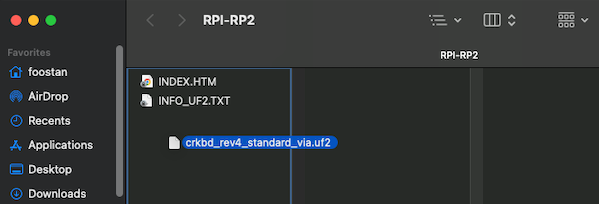
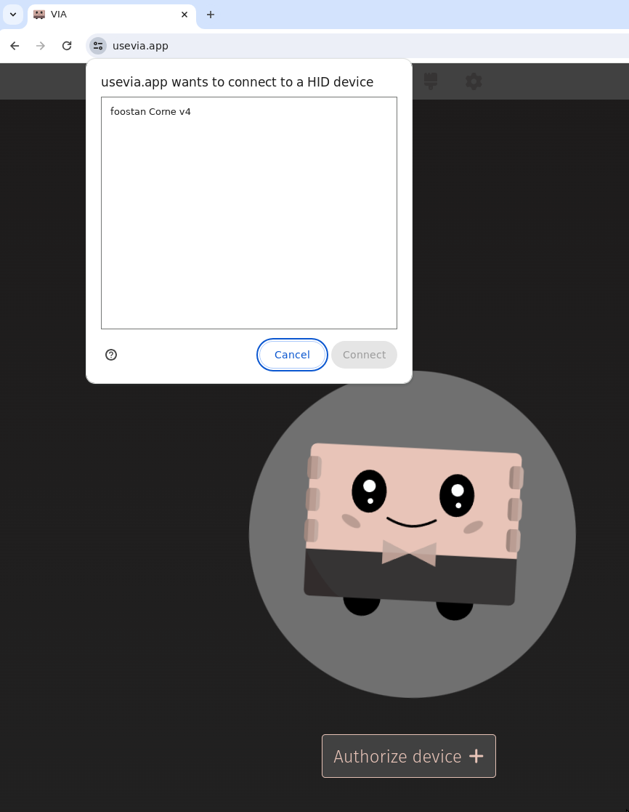

# Pro

## Parts

| Part                      | Count | Remark                  |
| ------------------------- | ----- | ----------------------- |
| PCB                       | 1 set |                         |
| Case bottom               | 1 set |                         |
| Switch plate              | 1 set |                         |
| ProMicro                  | 2     |                         |
| 12x1 Male-Male pin header | 4     |                         |
| Key switches              | 58    | Cherry MX or Kailh choc |
| Switch socket             | 58    |                         |
| SOD-123 diode             | 58    |                         |
| Keycaps                   | 58    |                         |
| Spacer M2                 | 10    | 7mm                     |
| Screw M2                  | 20    | 5mm                     |
| Rubber cushion            | 8     |                         |
| Pushbutton switch         | 2     | Tactile reset switch    |
| TRRS jack                 | 2     |                         |
| TRRS (4 poles) cable      | 1     |                         |
| Type-C cable              | 1     |                         |
| OLED module               | 0 - 2 | Optional                |

## Build


The Lily58 Pro PCB is reversible. It may help to add a small piece of tape to the front of each board while building.


Apply a solder patch to one side of each diode pad on the **back of the PCB**. Position the diode correctly and heat up the solder patch to allow the diode to melt in.&#x20;


Diodes are directional. The diode wire must be soldered pointing in the direction of the arrow symbol drawn on the board.&#x20;




<figure><figcaption><p><strong>Figure</strong>: Diodes positioned with one pad soldered.</p></figcaption></figure>

Once all diodes are in place, apply solder to the other side of each pad ensuring a complete connection.

Apply a solder patch to each switch socket pad on the **back of the PCB**. Position the switch sockets correctly and place the soldering iron tip between each connection point to heat up the solder below and allow each connector to melt in.

<figure><figcaption><p><strong>Figure</strong>: Diodes positioned with solder on each pad.</p></figcaption></figure>

On the **front of the PCB**, solder both the TRRS jack and pushbutton switch.

<figure><figcaption><p><strong>Figure</strong>: TRRS jack and pushbutton switch soldered.</p></figcaption></figure>

If you're soldering on a OLED module, it's important you bridge the four jumper terminals on the **front of the PCB** within the MCU section. Simply apply enough solder to bridge the four jumper terminals.

<figure><figcaption><p><strong>Figure</strong>: Jumper terminals bridged.</p></figcaption></figure>


Before soldering the MCU to the board, it's recommended to [flash the firmware](pro.md#firmware) on as it's easier to access the BOOT and RESET buttons.


Solder both 12x1 Male-Male pin headers within the square outline in the MCU section to the **front of the PCB**.&#x20;

<figure><figcaption><p><strong>Figure</strong>: Lily58 pin headers position diagram.</p></figcaption></figure>

Once in-place, solder the MCU to the 12x1 Male-Male pin headers **component side down**.

<figure><figcaption><p><strong>Figure</strong>: MCU and 12x1 Male-Male pin headers soldered.</p></figcaption></figure>

Add switches to the corners of the switch plate.

<figure><figcaption><p><strong>Figure</strong>: Switches in the corners of switch plate.</p></figcaption></figure>

Attach the PCB to the switch plate ensuring that the switch prongs line up and do not bend.

<figure><figcaption><p><strong>Figure</strong>: PCB attached to switch plate.</p></figcaption></figure>

Screw in the spacers to the bottom plate. Ensure not to tighter too much as this can damage the PCB and/or spacers.

<figure><figcaption><p><strong>Figure</strong>: Spacers screwed into the bottom plate.</p></figcaption></figure>

Place the PCB and switch plate on top of the spacers and screw them in. Ensure not to tighter too much as this can damage the PCB and/or spacers.

<figure><figcaption><p><strong>Figure</strong>: Bottom plate, PCB, and switch plate connected.</p></figcaption></figure>

Add the rest of the switches in and add keycaps.

## Firmware

### QMK


These steps are for advanced users or those comfortable with QMK. If you are not either of those, please follow the steps described in the [#uf2](pro.md#uf2 "mention") section below.


Perform the following steps for both sides of the keyboard.

1. Connect the side of the keyboard you intend to flash to the computer while holding down the BOOT button. If you're already plugged in to the computer, you can instead hold the BOOT button followed by the RESET button. This will mount the micro-controller.
2. Enter the following command to flash the board with the Lily58 firmware with Via configured:

```bash
qmk flash -c -kb lily58 -km via -e CONVERT_TO=elite_pi
```

### .uf2

Download the firmware for VIA.

* VIA - [lily58\_rev1\_via\_elite\_pi.uf2](https://github.com/kbdify/firmware/blob/main/lily58/lily58\_rev1\_via\_elite\_pi.uf2)

Perform the following steps for both sides of the keyboard.

1. Connect the side of the keyboard you intend to flash to the computer while holding down the BOOT button. If you're already plugged in to the computer, you can instead hold the BOOT button followed by the RESET button. This will mount the micro-controller.
2. Drag the downloaded `.uf2` file from above onto the mounted device. This will flash the firmware onto the micro-controller.

<figure><figcaption><p><strong>Figure:</strong> Flashing the firmware.</p></figcaption></figure>

## Configuration

### Via

1. Navigate to [https://usevia.app/](https://usevia.app/)
2. Select the desired device.

<figure><figcaption><p><strong>Figure:</strong> Authorizing device for configuration in VIA.</p></figcaption></figure>

3. Refer to the [VIA user manual](https://www.caniusevia.com/docs/specification) for more information on configuring your keyboard.

<figure><figcaption><p><strong>Figure:</strong> Lily58 Pro within VIA.</p></figcaption></figure>
